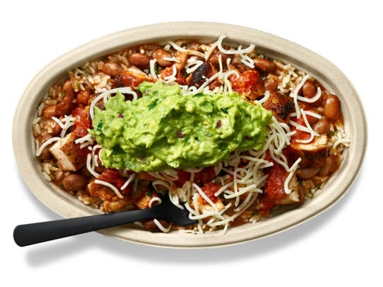

# chipotle-freeting

## About This Project

The idea for this project was born out of an obsession with Chipotle and the discovery of their "freeting" promotion (tweets with unique codes for free entrée items) during the 2019 NBA finals.

## How It Works

The script continuously scrapes Chipotle's Twitter page using the Twitter front end API and looks for new tweets. If a new tweet has been posted, it is then parsed for the free food code ("FREE" followed by a string of random characters), and this code is sent out to a list of contacts using Twilio's API.

## Current Goals

- Repurpose this project for other free food promotions.

## Demo

Sadly there aren't any cool visuals to show off this time, but here's a picture that's pretty similar to what I like to order whenever I go to Chipotle.

